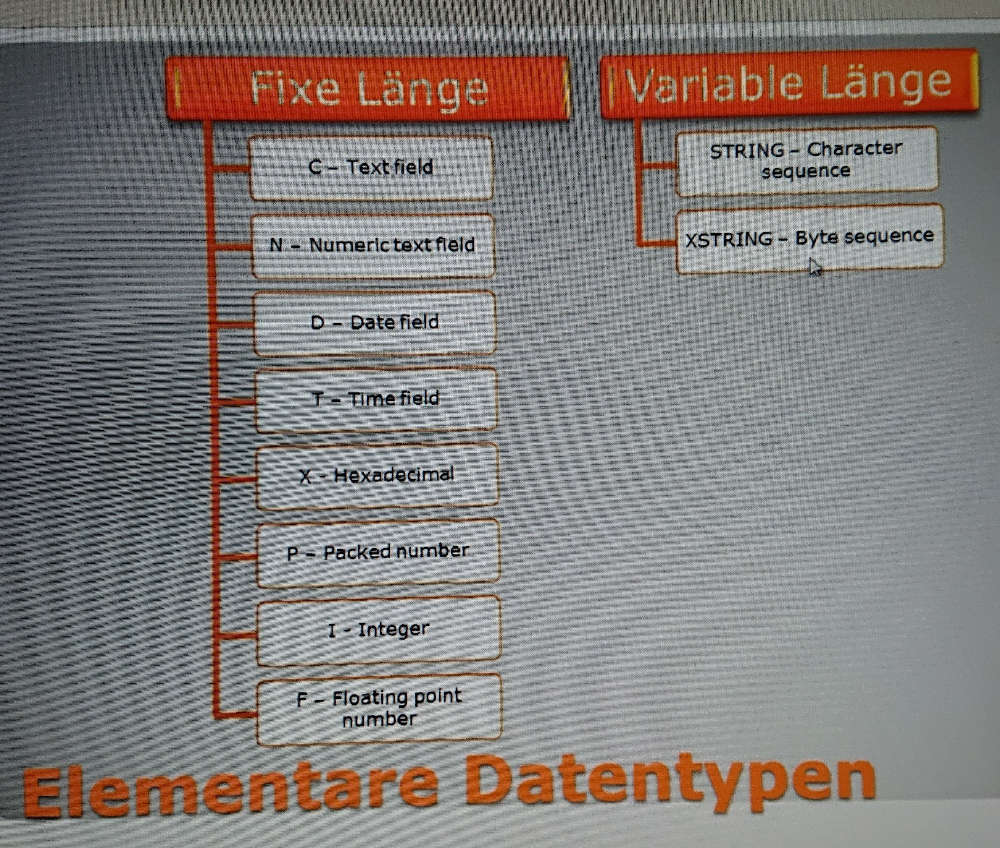
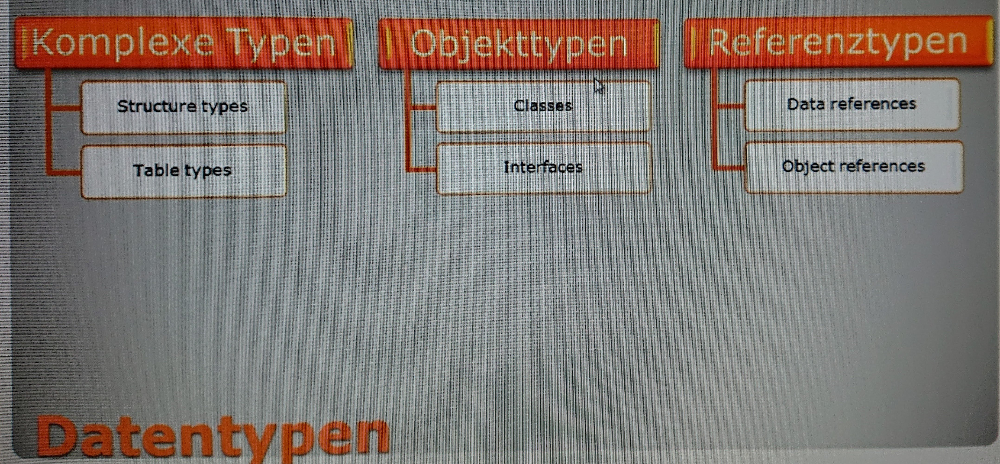

# SAP Customizing / ABAP

Jedes Unternehmen braucht aus handels- und steuerrechtlicher Sicht eine Buchhaltung. SAP ist im Prinzip ein Buchhaltungssystem. 

Will man SAP im Unternehmen einführen stellen sich folgende Fragen:  
1. Welche Module (FI, MM, SD, PS, ...)? 
2. Cloud- oder On-Premise-Lösung?  
3. Wie bilde ich meine Unternehmensstruktur im System ab (Buchungskreise, Werke, Lager, ...)?  
4. SAP ist Standardsoftware für Stahlkocher (voestalpine) als auch Handelsunternehmen (Spar, blue tomato). Unter Customizing versteht man unter anderem das Ausblenden von Eingabefeldern die nicht gebraucht werden. 
5. Customizing ist auch die Erweiterung um kundenspezifische "Reports" und diese Erweiterungen programmiert man in ABAP.  

## ABAP  

ABAP ... Advanced Business Application Programming  
*case insensitive*

Ressourcen:  
- <https://openbook.rheinwerk-verlag.de/einstieg_in_abap/index.html>
- Run ABAP code online: <https://abapeditor.com/> (funktioniert leider nicht)  
- VS Code Extension: Syntax Highlighting for ABAP: <https://marketplace.visualstudio.com/items?itemName=larshp.vscode-abap>
- Udemy Kurs: <https://www.udemy.com/course/sap-abap-programmierung-auf-einen-blick-abap-report-sap-lernen-kurs/>

Entwicklungsumgebung (im SAP GUI): SAP Menü > Werkzeuge > ABAP Workbench > Entwicklung >  
- ABAP Editor (SE38) ... Entwicklungsumgebung
- ABAP Dictionary (SE11) ... Verzeichnis für alle globalen Objekte  

Kunden**objekte** beginnen mit einem `Z`, `Y` oder einem sogenannten Präfixnamensraum. Ein Präfixnamensraum ist eine von Schrägstrichen eingerahmte, eindeutig bei SAP reservierte Buchstabenfolge, die dem Namen der Entwicklungsobjekte vorangestellt wird und die kein anderer SAP-Kunde in seinen kundenindividuellen Objekten verwenden darf – beispielsweise `/HTLKAINDORF/`.  

Will man sein erstelltes Programm (Report) fürs Transportsystem verwenden braucht's auch einen Paketnamen. Ansonsten `Local Object`  

SAP Transportsystem besteht aus folgenden 3 Systemen:  
- Entwicklungssystem  
- Testsystem  
- Produktivsystem  

Ein einfaches Programm besteht aus:  
- `Title` (z.B. *My first report*)  
- `Type`: `Executable program`  
- `Local Object` oder *Package name*  
  
Programm ausführen:  
Check (Syntaxprüfung) > Activate > Execute  

Schlüsselwortdokumentation:  
- Cursor auf Schlüsselwort + `F1`-Taste  

## Datentypen  

(c) Lekic, Ana: <https://www.udemy.com/course/sap-abap-programmierung-auf-einen-blick-abap-report-sap-lernen-kurs/>

  

  

## ABAP Dictionary  

Enthält alle Objekte im SAP System. 

Beispielobjekt:  
- Data element: MATNR  
- Short Description: Material Number  
- Domain MATNR

Jedes Objekt hat auch einen Verwendungsnachweis = Übersicht wo das Objekt verwendet wird.  

## Glossar  

**Domain** ... technische Spezifikation eines Datentyps, z.B. MATNR, Data Type CHAR, Length 18  

**Kommentar im Quellcode**:  
- gesamte Zeile: erstes Zeichen `*`  
- ab bestimmter Position `"`  

**Report** .. gewöhnliches ABAP Programm  

